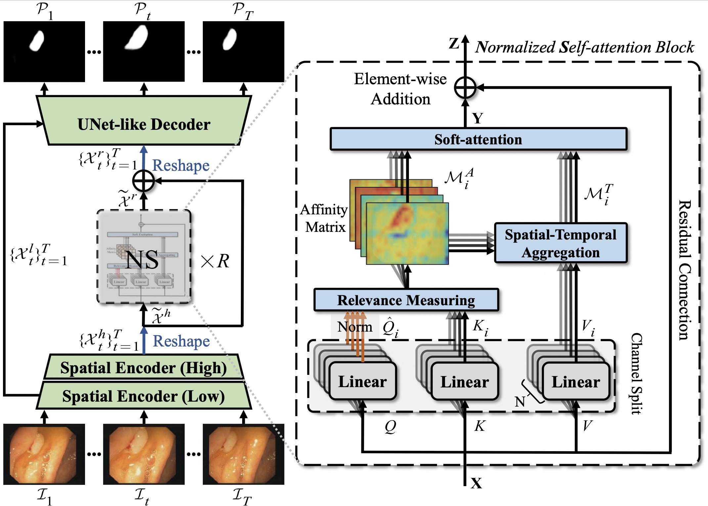
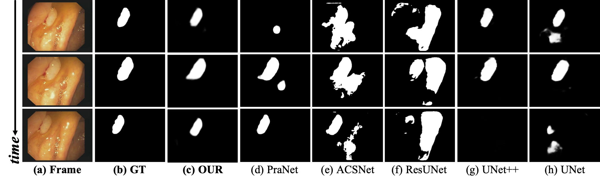

# Progressively Normalized Self-Attention Network for Video Polyp Segmentation


> **Authors:** 
> [Ge-Peng Ji*](https://scholar.google.com/citations?user=oaxKYKUAAAAJ&hl=en), 
> [Yu-Cheng Chou*](https://scholar.google.com/citations?user=YVNRBTcAAAAJ&hl=en), 
> [Deng-Ping Fan](https://dpfan.net/), 
> [Geng Chen](https://www.researchgate.net/profile/Geng_Chen13), 
> [Huazhu Fu](http://hzfu.github.io/), 
> [Debesh Jha](https://www.simula.no/people/debesh), &
> [Ling Shao](http://www.inceptioniai.org/).

This repository provides code for paper"_**Progressively Normalized Self-Attention Network for Video Polyp Segmentation**_" published at the MICCAI-2021 conference ([arXiv Version](https://arxiv.org/abs/2105.08468) | [中文版]()). 
If you have any questions about our paper, feel free to contact me.
And if you like our PNS-Net or evaluation toolbox for your personal research, please cite this paper ([BibTeX](#4-citation)).

## Features

- **Hyper Real-time Speed**: Our method, named Progressively Normalized Self-Attention Network (PNS-Net), can efficiently learn representations from polyp videos with real-time speed (~140fps) on a single NVIDIA RTX 2080 GPU without any post-processing techniques (_e.g._, Dense-CRF).
- **Plug-and-Play Module**: The proposed core module, termed Normalized Self-attention (NS), utilizes channel split,query-dependent, and normalization rules to reduce the computational cost and improve the accuracy, respectively. Note that this module can be flexibly plugged into any framework customed.
- **Cutting-edge Performance**: Experiments on three challenging video polyp segmentation (VPS) datasets demonstrate that the proposed PNS-Net achieves state-of-the-art performance. 
- **One-key Evaluation Toolbox**: We release the first one-key evaluation toolbox in the VPS field.

### 1.1. 🔥NEWS🔥 :
- [2021/05/27] Uploading the training/testing dataset, snapshot, and benchmarking results.
- [2021/05/14] Our work is provisionally accepted at [MICCAI 2021](https://miccai2021.org/en/). Many thanks to my collaborator Yu-Cheng Chou and supervisor Prof. Deng-Ping Fan.
- [2021/03/10] Create repository.


### 1.2. Table of Contents

- [PNS-Net: Progressively Normalized Self-Attention Network for Video Polyp Segmentation](#pns-net-progressively-normalized-self-attention-network-for-video-polyp-segmentation)
  - [Hightlights](#hightlights)
    - [1.1. 🔥NEWS🔥 :](#11-news-)
    - [1.2. Table of Contents](#12-table-of-contents)
    - [1.3. State-of-the-art Approaches](#13-state-of-the-art-approaches)
  - [2. Overview](#2-overview)
    - [2.1. Introduction](#21-introduction)
    - [2.2. Framework Overview](#22-framework-overview)
    - [2.3. Qualitative Results](#23-qualitative-results)
  - [3. Proposed Baseline](#3-proposed-baseline)
    - [3.1. Training/Testing](#31-trainingtesting)
    - [3.2 Evaluating your trained model:](#32-evaluating-your-trained-model)
    - [3.3 Pre-computed maps:](#33-pre-computed-maps)
  - [4. Citation](#4-citation)
  - [5. TODO LIST](#5-todo-list)
  - [6. FAQ](#6-faq)

<small><i><a href='http://ecotrust-canada.github.io/markdown-toc/'>Table of contents generated with markdown-toc</a></i></small>

### 1.3. State-of-the-art Approaches  
1. "PraNet: Parallel Reverse Attention Network for Polyp Segmentation" MICCAI, 2020.
doi: https://arxiv.org/pdf/2006.11392.pdf
2. "Adaptive context selection for polyp segmentation" MICCAI, 2020.
doi: https://link.springer.com/chapter/10.1007/978-3-030-59725-2_25
3. "Resunet++: An advanced architecture for medical image segmentation" IEEE ISM, 2019
doi: https://arxiv.org/pdf/1911.07067.pdf
4. "Unet++: A nested u-net architecture for medical image segmentation" IEEE TMI, 2019
doi: https://www.ncbi.nlm.nih.gov/pmc/articles/PMC7329239/
5. "U-Net: Convolutional networks for biomed- ical image segmentation" MICCAI, 2015.
doi: https://arxiv.org/pdf/1505.04597.pdf


## 2. Overview

### 2.1. Introduction

Existing video polyp segmentation (VPS) models typically employ convolutional neural networks (CNNs) to extract features. 
However, due to their limited receptive fields, CNNs can not fully exploit the global temporal and spatial information in successive video frames, resulting in false positive segmentation results. 
In this paper, we propose the novel PNS-Net (Progressively Normalized Self-attention Network), which can efficiently learn representations from polyp videos with real-time speed (~140fps) on a single RTX 2080 GPU and no post-processing. 

Our PNS-Net is based solely on a basic normalized self-attention block, dispensing with recurrence and CNNs entirely. Experiments on challenging VPS datasets demonstrate that the proposed PNS-Net achieves state-of-the-art performance. 
We also conduct extensive experiments to study the effectiveness of the channel split, soft-ttention, and progressive learning strategy. 
We find that our PNS-Net works well under different settings, making it a promising solution to the VPS task.

### 2.2. Framework Overview

<p align="center">
     <br />
    <em> 
    Figure 1: Overview of the proposed PNS-Net, including the normalized self-attention block (see § 2.1) with a stacked (×R) learning strategy. 
    See § 2 in the paper for details.
    </em>
</p>

### 2.3. Qualitative Results

<p align="center">
     <br />
    <em> 
    Figure 2: Qualitative Results.
    </em>
</p>

## 3. Proposed Baseline

### 3.1. Training/Testing

The training and testing experiments are conducted using [PyTorch](https://github.com/pytorch/pytorch) with 
a single GeForce RTX 2080 GPU of 8 GB Memory.


1. Configuring your environment (Prerequisites):
   
    Note that PNS-Net is only tested on Ubuntu OS with the following environments. 
    It may work on other operating systems as well but we do not guarantee that it will.
    
    + Creating a virtual environment in terminal: 
      
    `conda create -n PNSNet python=3.6`.
    
    + Installing necessary packages PyTorch 1.1: 
      
    ```bash
    conda create -n PNSNet python=3.6
    conda activate PNSNet
    conda install pytorch=1.1.0 torchvision -c pytorch
    pip install tensorboardX tqdm Pillow==6.2.2
    pip install git+https://github.com/pytorch/tnt.git@master
    ```
    
    + Our core design is build on CUDA OP with torchlib. 
      Please ensure the base [CUDA toolkit](https://developer.nvidia.com/cuda-toolkit-archive) 
      version is 10.x (not at conda env), and then build the NS Block: 

    ```bash
    cd ./lib/PNS
    python setup.py build develop
    ```

1. Downloading necessary data:
    
    + downloading the training/testing dataset and move it into `./dataset/*`, 
      which can be found in this [download link (Google Drive, 2GB)](https://drive.google.com/file/d/1NuXYxgulyw3LdskK9svH1rg0E4Dqh69n/view?usp=sharing).
    
    + downloading pretrained weights and move it into `snapshot/ours/PNS.pth`, 
    which can be found in this [download link (Google Drive, 99MB)](https://drive.google.com/file/d/1YCP8g_Zc-uuqJhYt81U3sxxJbZy0FDiS/view?usp=sharing).
       
1. Training Configuration:

    + First, run `python MyTrain_Pretrain.py` in terminal for pretraining, and then, run `python MyTrain_finetune.py` for finetuning.
    
    + Just enjoy it! Finish it and the snapshot would save in `./snapshot/PNS-Net/*`.

1. Testing Configuration:

    + After you download all the pre-trained model and testing dataset, 
    just run `MyTest_finetune.py` to generate the final prediction map in `./res`.
    
    + Just enjoy it!
    
    + The prediction results of all competitors, and our PNS-Net can be found at [Google Drive (7MB)](https://drive.google.com/file/d/1Jn4EjnGC37WOfNjCGhxsEY7t26Brx6YV/view?usp=sharing).

### 3.2 Evaluating your trained model:

One-key evaluation is written in MATLAB code ([link](https://github.com/GewelsJI/PNS-Net/tree/main/eval)), 
please follow this the instructions in `./eval/main_VPS.m` and just run it to generate the evaluation results in `./eval-Result/`.

## 4. Citation

Please cite our paper if you find the work useful: 
    
    @inproceedings{ji2021pnsnet,
      title={Progressively Normalized Self-Attention Network for Video Polyp Segmentation},
      author={Ji, Ge-Peng and Chou, Yu-Cheng and Fan, Deng-Ping and Chen, Geng and Jha, Debesh and Fu, Huazhu and Shao, Ling},
      journal={MICCAI},
      year={2021}
    }

## 5. TODO LIST

> If you want to improve the usability or any piece of advice, please feel free to contact me directly ([E-mail](gepengai.ji@gmail.com)).

- [ ] Support `NVIDIA APEX` training.

- [ ] Support different backbones (
VGGNet, 
ResNet, 
[ResNeXt](https://github.com/facebookresearch/ResNeXt),
[iResNet](https://github.com/iduta/iresnet), 
and 
[ResNeSt](https://github.com/zhanghang1989/ResNeSt) 
etc.)

- [ ] Support distributed training.

- [ ] Support lightweight architecture and real-time inference, like MobileNet, SqueezeNet.

- [ ] Support distributed training

- [ ] Add more comprehensive competitors.

## 6. FAQ

1. If the image cannot be loaded in the page (mostly in the domestic network situations).

    [Solution Link](https://blog.csdn.net/weixin_42128813/article/details/102915578)

---

## 7. Acknowledgements

This code is built on SINetV2 ([PyTorch](https://github.com/GewelsJI/SINet-V2)) and PyramidCSA ([PyTorch](https://github.com/guyuchao/PyramidCSA)). We thank the authors for sharing the codes.

**[⬆ back to top](#0-preface)**
